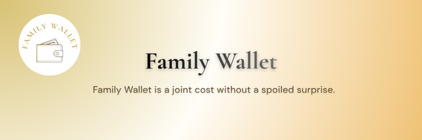
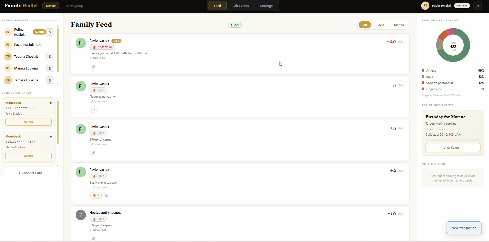
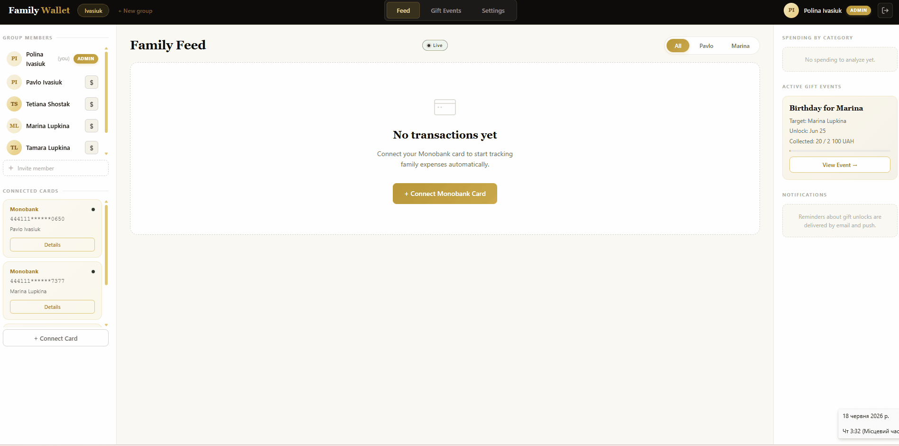
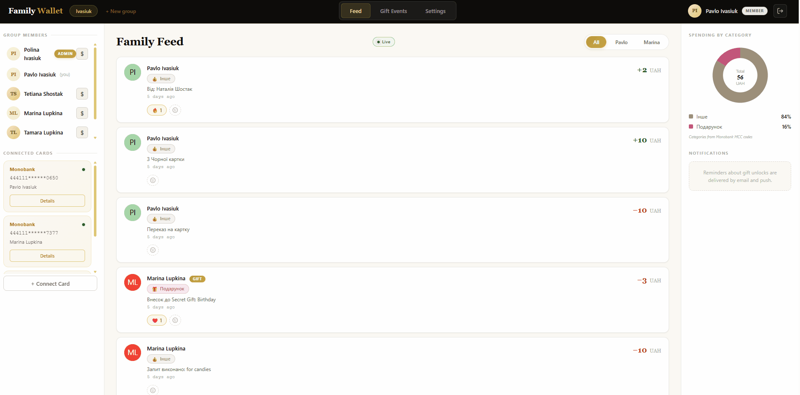
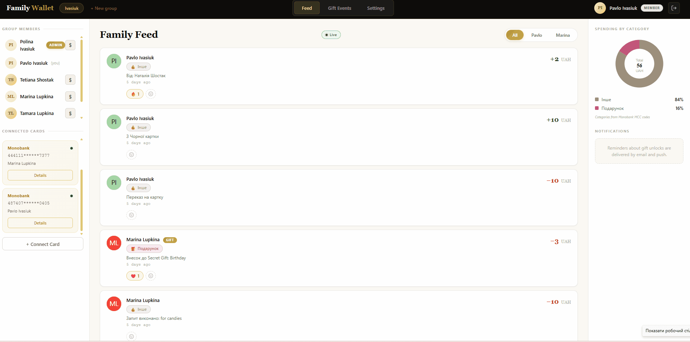
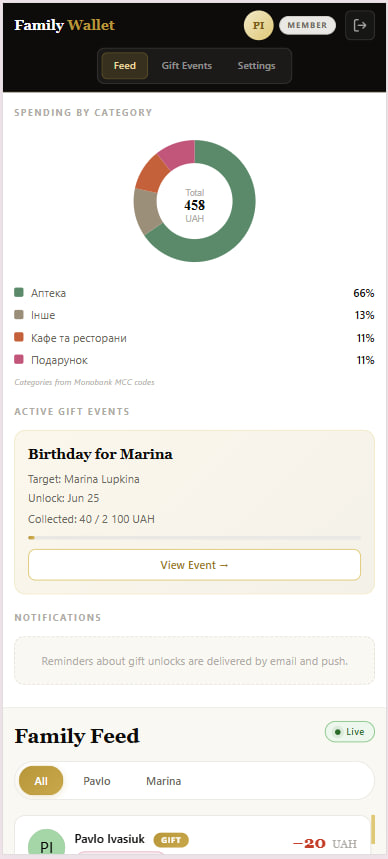
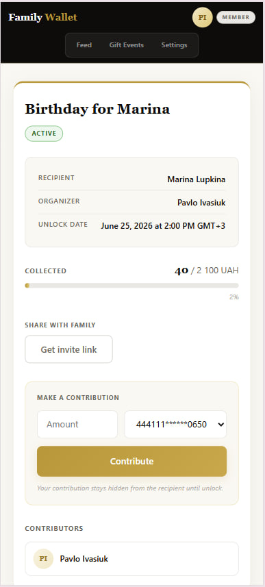
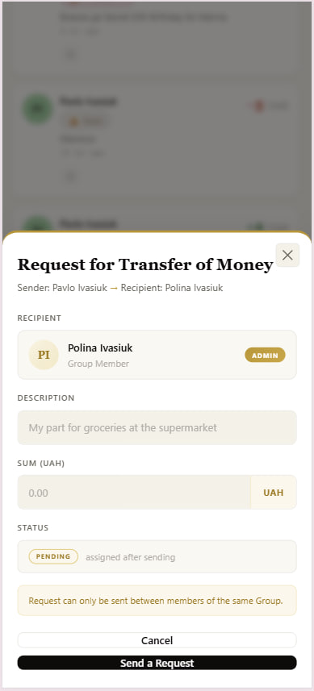
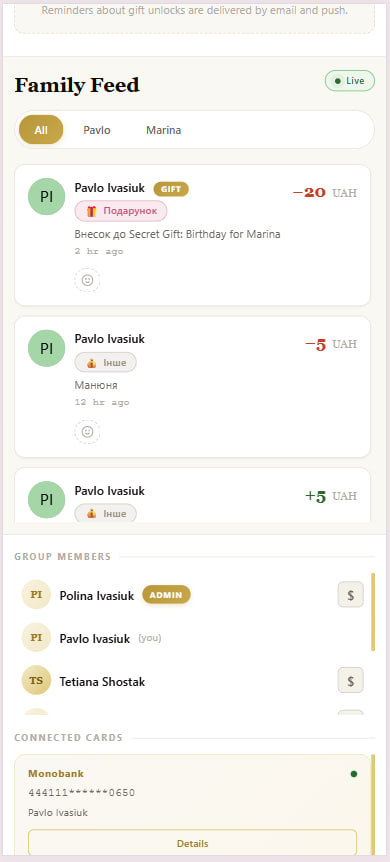
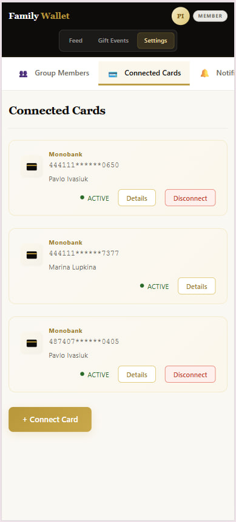

<p align="center">
  
</p>

# Family Wallet


Веб-застосунок для управління сімейним бюджетом — спільна стрічка витрат родини в реальному часі на базі Monobank, із таємним збором на подарунки та банківським рівнем захисту даних.

## ✨ Features

- 🔴 **Витрати родини наживо** — усі транзакції з карток Monobank з'являються у спільній стрічці в ту ж секунду, коли стались, без жодного оновлення сторінки (real-time WebSocket).
- 🎁 **Сюрприз, який не зіпсувати** — скидайтеся на подарунок усією родиною так, що іменинник не побачить ні збору, ні внесків до дати розкриття (Secret Gift із серверною ізоляцією).
- 🔐 **Банківський рівень захисту** — ваш Monobank-токен зашифровано за стандартом AES-256, а доступ — лише на читання: застосунок фізично не може зняти ваші гроші.
- 💸 **Гроші між рідними за пару кліків** — миттєвий віртуальний переказ між картками родини або запит «скинь на каву» з підтвердженням в один тап.
- 📊 **Зрозуміло, куди йдуть гроші** — автоматична категоризація покупок за MCC-кодами банку та наочна діаграма витрат за категоріями.
- 👨‍👩‍👧 **Спільний бюджет із ролями** — об'єднайте родину в групу з ролями Admin/Member і запросіть учасників захищеним посиланням з обмеженим строком дії.
- ❤️ **Облік, що оживає** — додавайте емодзі-реакції до покупок рідних: бюджет стає стрічкою як у соцмережі, а не нудною таблицею.
- 🔔 **Нагадування, що не дають забути** — push- та email-сповіщення про наближення розкриття подарунка та важливі події групи.

## 📦 Marketing Kit

Уся «товарна упаковка» проєкту — бренд, демо-матеріали, ринкова стратегія та презентаційні слайди — зібрана в теці [`docs/marketing/`](docs/marketing/). Якщо технічна документація доводить, що система **працює**, то Marketing Kit доводить, що вона **потрібна ринку**.

### 🎨 Бренд (Brand Identity)

<p align="center">
  
</p>

| Актив                 | Файл(и)                                                                                                                                                         |
| --------------------- | --------------------------------------------------------------------------------------------------------------------------------------------------------------- |
| Hero-банер            | [`banner.png`](docs/marketing/branding/banner.png)                                                                                                              |
| Логотип (світлий фон) | [`logo_primary.png`](docs/marketing/branding/logo_primary.png)                                                                                                  |
| Логотип (темний фон)  | [`logo_white.png`](docs/marketing/branding/logo_white.png) · [`logo_white_round.png`](docs/marketing/branding/logo_white_round.png)                             |
| Анімований логотип    | [`.gif`](docs/marketing/branding/logo_animated.gif) · [`.webp`](docs/marketing/branding/logo_animated.webp) · [APNG](docs/marketing/branding/logo_animated.png) |
| Style Guide           | [`BRAND_STYLE_GUIDE.md`](docs/marketing/branding/BRAND_STYLE_GUIDE.md)                                                                                          |

**Палітра:** `#B8973A` Gold · `#0D0C0A` Ink · `#FAF8F3` Cream · `#2A6B2A` Live · `#C2557A` Gift · заголовки — **Cormorant Garamond**.

### 🎬 Продукт у дії (Product in Action)

|                     Стрічка витрат наживо                     |                       Secret Gift — серверна ізоляція                        |
| :-----------------------------------------------------------: | :--------------------------------------------------------------------------: |
|  |  |
|                **Підключення картки Monobank**                |                        **Переказ коштів між рідними**                        |
|     |                            |

<details>
<summary>📂 Усі 20 GIF-сценаріїв (покривають 100% функціоналу MVP)</summary>

| #   | Сценарій                                                                 | #   | Сценарій                                                                   |
| --- | ------------------------------------------------------------------------ | --- | -------------------------------------------------------------------------- |
| 01  | [Реєстрація](docs/marketing/assets/01-register.gif)                      | 11  | [Вибір групи](docs/marketing/assets/11-select-group.gif)                   |
| 02  | [Логін](docs/marketing/assets/02-login.gif)                              | 12  | [Стрічка наживо](docs/marketing/assets/12-realtime-feed.gif)               |
| 03  | [Створення групи](docs/marketing/assets/03-create-group.gif)             | 13  | [Прийняття запиту](docs/marketing/assets/13-accept-request.gif)            |
| 04  | [Підключення картки](docs/marketing/assets/04-connect-card.gif)          | 14  | [Запрошення учасника](docs/marketing/assets/14-invite-member.gif)          |
| 05  | [Переказ](docs/marketing/assets/05-transfer.gif)                         | 15  | [Ізоляція Secret Gift](docs/marketing/assets/15-secret-gift-isolation.gif) |
| 06  | [Запит коштів](docs/marketing/assets/06-money-request.gif)               | 16  | [Відхилення запиту](docs/marketing/assets/16-request-declined-answer.gif)  |
| 07  | [Створення Secret Gift](docs/marketing/assets/07-create-secret-gift.gif) | 17  | [Приєднання до події](docs/marketing/assets/17-gift-join.gif)              |
| 08  | [Внесок у подарунок](docs/marketing/assets/08-gift-contribute.gif)       | 18  | [Валідація форми](docs/marketing/assets/18-form-validation.gif)            |
| 09  | [Фільтри стрічки](docs/marketing/assets/09-feed-filters.gif)             | 19  | [Відновлення пароля](docs/marketing/assets/19-forgot-password.gif)         |
| 10  | [Деталі картки](docs/marketing/assets/10-card-details.gif)               | 20  | [Вихід із системи](docs/marketing/assets/20-logout.gif)                    |

</details>

### 📱 Скріншоти та адаптивність (Mobile View)

<p align="center">
  
  
  
  
  
</p>

📖 Інтерактивне демо мобільної версії: **[Static Highlights — mobile (Scribe)](https://scribehow.com/o/IsN2_lSWTNyFwRjP4qXQXA/viewer/Static_Highlights_mobile-version___muJn_FIRXqE0TYlLEmZBA)**

> ✅ Адаптивність перевірено на мобільних роздільностях (Pixel 7 — 412×915): верстка не «ламається», усі ключові екрани читабельні на смартфоні.

### 📊 Стратегія та презентація

| Документ                                                                                                                                                | Що всередині                                                                      |
| ------------------------------------------------------------------------------------------------------------------------------------------------------- | --------------------------------------------------------------------------------- |
| [01 · Product Strategy](docs/marketing/01_Product_Strategy_Document.md)                                                                                 | SWOT, персони, конкурентна матриця, positioning                                   |
| [02 · Monetization Canvas](docs/marketing/02_Monetization_Canvas.md)                                                                                    | Value Proposition, тарифи, CAC-гіпотеза, юніт-економіка                           |
| [03 · Technical USP](docs/marketing/03_Technical_USP_Slide.md)                                                                                          | USP з інженерним обґрунтуванням переваги                                          |
| [04 · Market-Ready RTM](docs/marketing/04_Market_Ready_RTM.md)                                                                                          | Матриця вимог за рівнями доступу (Free / Pro / Family+)                           |
| [05 · Promotion & Marketing Kit](docs/marketing/05_Promotion_Marketing_Kit.md) ([PDF](docs/marketing/05_Promotion_Marketing_Kit.pdf))                   | Elevator Pitch, контент-план, стратегія Product Hunt                              |
| 🎤 **Pitch Deck — Demo** (5 слайдів) · [PDF](docs/marketing/06_Pitch_Deck.pdf) · [PPTX](docs/marketing/06_Pitch_Deck.pptx)                              | Ринковий потенціал: Problem & Solution, USP, аудиторія, монетизація, Go-to-Market |
| 🛠 **Project Pitch Deck — технічний** (8 слайдів) · [PDF](docs/marketing/07_Project_Pitch_Deck.pdf) · [PPTX](docs/marketing/07_Project_Pitch_Deck.pptx) | Проблема, MVP, стек, архітектура FE/BE/DB, інженерні виклики, roadmap             |
| [Elevator Pitch (текст)](docs/copywriting/elevator_pitch.txt)                                                                                           | 60-секундна промова для інвесторів/користувачів                                   |

📎 [QR-код репозиторію](docs/marketing/branding/qr_github.png) — для слайдів і друкованих матеріалів.

### 🗂 Структура `docs/marketing/`

```
docs/marketing/
├── branding/        # логотипи, hero-банер, анімований логотип, QR, style guide
├── assets/          # 20 GIF-анімацій (Product in Action)
├── strategy/        # market_analysis.pdf, social_media_plan.xlsx — у роботі
├── video/           # промо-ролик 45–60 сек — у роботі
├── 01–04_*.md       # SWOT, монетизація, USP, RTM
├── 05_*.md / .pdf   # комунікаційна стратегія (Promotion)
└── 06_*.md          # слайди pitch deck
```

## Технології

- **Frontend:** Vue 3, Vue Router, Axios, Vite, composables (стан без Pinia/Vuex)
- **Backend:** FastAPI, Uvicorn, Motor (async MongoDB)
- **База даних:** MongoDB Atlas
- **Деплой:** Cloudflare Pages (frontend), Render.com (backend), GitHub Actions CI/CD
- **Контейнеризація:** Docker, Docker Compose

## Pre-requisites (Системні вимоги)

Версії, на яких гарантується стабільна робота:

| Категорія          | ПЗ                      | Версія                                           |
| ------------------ | ----------------------- | ------------------------------------------------ |
| Контейнеризація    | Docker / Docker Compose | Docker 24+ / Compose v2+                         |
| Runtime (backend)  | Python                  | **3.12+**                                        |
| Runtime (frontend) | Node.js                 | **20+**                                          |
| Збірка (backend)   | pip                     | 24+                                              |
| Збірка (frontend)  | npm                     | 10+                                              |
| СУБД               | MongoDB                 | **Atlas (хмарна)** або локально **MongoDB 6.0+** |

> **Найшвидший шлях** — через Docker Compose (потрібен лише Docker). Локальний запуск без Docker потребує встановлених Python 3.12+ та Node.js 20+.

## Налаштування змінних середовища

Скопіюйте `.env.example` в `.env` та заповніть значення:

```bash
cp .env.example .env
```

Повний перелік змінних — у файлі [`.env.example`](.env.example) (джерело правди). Основні:

**Backend:**

| Змінна                    | Опис                                                          |
| ------------------------- | ------------------------------------------------------------- |
| `MONGO_ATLAS`             | Connection string для MongoDB Atlas                           |
| `DB_NAME`                 | Назва бази даних (за замовчуванням `FamilyWallet`)            |
| `JWT_SECRET`              | Секретний ключ для JWT токенів                                |
| `MONOBANK_ENCRYPTION_KEY` | AES-256 ключ (base64) для шифрування токенів Monobank         |
| `MONOBANK_WEBHOOK_URL`    | Публічний https URL бекенду для webhook'ів Monobank           |
| `CORS_ORIGINS`            | Дозволені origins фронтенду через кому                        |
| `ENV`                     | `development` / `production` (активує fail-fast для секретів) |

**Frontend (Vite):**

| Змінна               | Опис                                           |
| -------------------- | ---------------------------------------------- |
| `VITE_API_BASE_URL`  | URL бекенд-API (напр. `http://localhost:8000`) |
| `VITE_WS_BASE_URL`   | URL WebSocket-стрічки                          |
| `VITE_WS_ENABLED`    | Увімкнення WebSocket (`true`/`false`)          |
| `VITE_REALTIME_MODE` | Режим реального часу: `off` / `ws` / `polling` |

> 🔒 **Безпека:** реальний файл `.env` **ніколи не комітиться** в репозиторій — він внесений до `.gitignore` (ігноруються `.env` та `.env.*`, виняток — лише шаблон `.env.example`). У репозиторій потрапляє **тільки** `.env.example` з порожніми/прикладовими значеннями та коментарями до кожного ключа.

## Запуск через Docker Compose (рекомендовано)

```bash
docker-compose up --build
```

Це запустить:

- **Backend** на `http://localhost:8000` (з hot reload)
- **Frontend** на `http://localhost:5173` (з hot reload)

Для запуску у фоновому режимі:

```bash
docker-compose up --build -d
```

Зупинити контейнери:

```bash
docker-compose down
```

## Тестові доступи (Credentials)

Для входу в систему під час перевірки використовуйте тестовий обліковий запис:

| Поле   | Значення          |
| ------ | ----------------- |
| Email  | `admin@gmail.com` |
| Пароль | `Administrator`   |

Роль: **Administrator**. Обліковий запис вже створений у тестовій базі (MongoDB Atlas), додаткова реєстрація не потрібна.

## Локальний запуск без Docker

### Backend

```bash
cd backend
python -m venv venv
source venv/bin/activate        # Linux/Mac
# venv\Scripts\activate         # Windows
pip install -r requirements.txt
uvicorn app.main:app --reload --port 8000
```

API буде доступне на `http://localhost:8000`

### Frontend

```bash
cd frontend
npm install
npm run dev
```

Застосунок буде доступний на `http://localhost:5173`

## База даних: розгортання та демо-дані (Database Setup)

Проєкт використовує **MongoDB** (Atlas або локальний інстанс) з ODM **Beanie**.

> 💡 **Міграцій схеми у класичному розумінні немає** — MongoDB безсхемна, колекції створюються автоматично при першому записі. Натомість є **одна міграція ініціалізації + наповнення демо-даними** (`backend/migrations/`), щоб база **не була порожньою** після встановлення.

### Наповнення демо-даними (Seed)

Міграція `20260416130111_init_db_and_seed.py` створює готовий до демонстрації набір: категорії, двох користувачів (Admin + Member), сімейну групу, дві картки з балансами, історію транзакцій, активний **Secret Gift** та запит коштів.

```bash
cd backend
source .venv/bin/activate                 # активуйте venv (див. «Локальний запуск»)
# Значення MONGO_ATLAS та DB_NAME беруться з вашого .env
beanie migrate -uri "$MONGO_ATLAS" -db "$DB_NAME" -p migrations
```

Відкат демо-даних (очищення колекцій):

```bash
beanie migrate -uri "$MONGO_ATLAS" -db "$DB_NAME" -p migrations --backward
```

> ⚠️ Якщо ви підключаєтесь до **спільної тестової бази Atlas** (див. «Тестові доступи» нижче) — база вже наповнена, запускати seed **не потрібно**. Seed призначений для розгортання на **власній/порожній** базі.

## Деплой

Деплой відбувається автоматично при пуші в гілку `production`:

1. Backend деплоїться на Render.com — https://family-wallet-backend-tb1v.onrender.com/
2. Frontend деплоїться на Cloudflare Pages — https://family-wallet.pages.dev/

## Code Style

Проєкт дотримується задокументованих стандартів коду. Детальний опис правил — у файлі [`STYLEGUIDE.md`](STYLEGUIDE.md).

Короткий огляд:

- **Frontend:** [Airbnb Style Guide](https://github.com/airbnb/javascript), ESLint + Prettier, 2 пробіли, без `;`
- **Backend:** [PEP 8](https://peps.python.org/pep-0008/), Ruff, 4 пробіли, подвійні лапки
- **Format on Save** налаштовано у `.vscode/settings.json`

```bash
make check    # Перевірка лінтерів + форматування
make lint-fix # Автовиправлення лінтерів
make format   # Автоформатування
```

## Тестування

```bash
cd backend
pip install -r requirements.txt   # одноразово (включно з firebase-admin/sendgrid)
pytest                            # усі тести
pytest tests/unit                 # лише unit
pytest tests/integration          # лише integration
```

Підсумок фінального тестування (статистика, середовище, known issues) — у файлі
[`docs/TEST_SUMMARY_REPORT.md`](docs/TEST_SUMMARY_REPORT.md). Поточний статус: **89 тестів, 100% passed**.

## Архітектурна документація

- [Architectural Decision Record: System Style](docs/Architectural%20Decision%20Record%20-%20System%20Style.md) — обґрунтування вибору архітектурного стилю (Modular Monolith)
- [Software Architecture Document: Internal View](docs/Software%20Architecture%20Document%20-%20Internal%20View.md) — вибір внутрішнього архітектурного патерну (Layered Architecture)
- [Data Flow & Interaction Specification](docs/Data%20Flow%20%26%20Interaction%20Specification.md) — потоки даних та взаємодія компонентів

## Структура проєкту

```
Family-Wallet/
├── docs/                          # Документація, ТЗ, діаграми, API-специфікації
├── backend/                       # Backend-частина (Сервер)
│   └── app/
│       ├── api/                   # Presentation Layer — роутери, HTTP-ендпоінти
│       ├── services/              # Business Logic Layer — сценарії використання
│       ├── repositories/          # Data Access Layer — робота з MongoDB
│       ├── models/                # Структури даних (Entities)
│       ├── schemas/               # DTO — контракти API (Pydantic)
│       ├── middleware/            # JWT авторизація, CORS, обробка помилок
│       ├── config/                # Налаштування підключень, змінні середовища
│       └── main.py                # Точка входу FastAPI
├── frontend/                      # Frontend-частина (Клієнт)
│   └── src/
│       ├── components/            # UI-компоненти (кнопки, картки, форми)
│       ├── views/                 # Сторінки (Login, Dashboard, Wallet)
│       ├── services/              # API-клієнт (Axios запити до Backend)
│       ├── composables/          # Стан і логіка (useAuth, useWebSocket, usePersistentState…)
│       └── assets/                # Статичні ресурси (зображення, шрифти, стилі)
├── shared/                        # Спільні ресурси (типи, константи)
├── deploy/                        # Конфігурації для Docker, CI/CD, скрипти розгортання
├── .github/workflows/             # CI/CD: автодеплой (Cloudflare Pages + Render.com)
├── docker-compose.yml             # Локальна розробка
├── .editorconfig                  # Загальні правила форматування
└── .env.example                   # Шаблон змінних середовища
```
